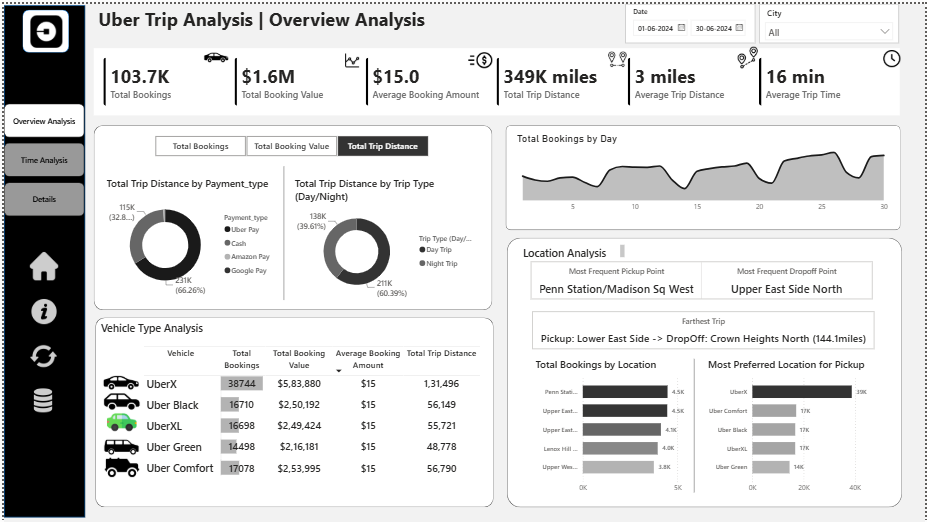
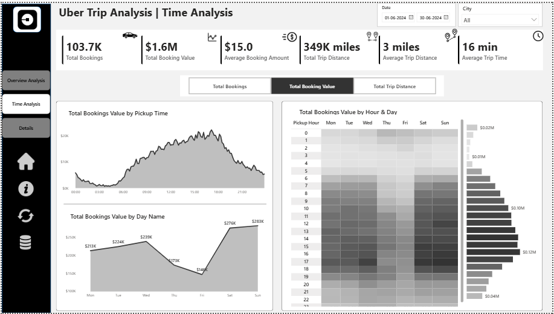
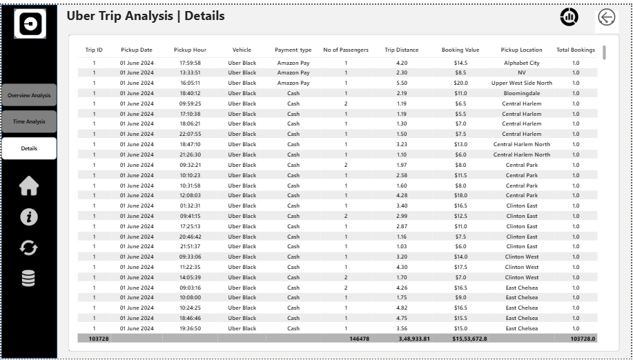

<div align="center">

# 🚕 Uber Trip Analysis Dashboard
### An End-to-End Power BI Business Intelligence Solution


</div>

---

## 📑 Table of Contents

1. [Executive Summary](#-executive-summary)
2. [Business Problem](#-business-problem)
3. [Solution Architecture](#-solution-architecture)
4. [Dashboard Walkthrough](#-dashboard-walkthrough)
5. [Data Dictionary](#-data-dictionary)
6. [Technical Highlights](#-technical-highlights)
7. [Key Business Insights](#-key-business-insights)
8. [Tools & Technologies](#-tools--technologies)
9. [Repository Structure](#-repository-structure)
10. [Dashboard Previews](#-dashboard-previews)
11. [Key Takeaways / Business Impact](#-key-takeaways--business-impact)
12. [How to Use](#-how-to-use-this-project)
13. [Future Enhancements](#-future-enhancements)
14. [Contact](#-contact)

---

## 📋 Executive Summary

Ride-hailing platforms like Uber generate high-volume, high-frequency operational data — every trip carries information about timing, location, distance, revenue, and vehicle usage. Left as raw transactional records, this data has limited value. Structured correctly, it becomes the backbone of pricing strategy, driver allocation, and demand forecasting.

This project delivers a **three-dashboard Power BI solution** that converts raw Uber trip data into an interactive decision-support tool, purpose-built for three levels of business need:

| Audience | Need | Dashboard |
|---|---|---|
| Executives / Stakeholders | Fast, high-level operational health check | **Overview Analysis** |
| Operations / Demand Planning | Understand *when* demand happens | **Time Analysis** |
| Analysts | Investigate individual trip records | **Details Tab** |

The result is a single `.pbix` file with **6 core KPIs, a dynamic multi-metric selector, 10+ visuals, drill-through navigation, and interactive bookmarking** — built to Power BI professional standards for modeling, DAX efficiency, and UX design.

---

## 🎯 Business Problem

Uber (or any ride-hailing operator) needs to answer a consistent set of operational questions on an ongoing basis:

- How many trips are being booked, and how is revenue trending?
- Are trips efficient — i.e., is distance/time reasonable relative to fare?
- When during the day/week does demand peak, and when does it dip?
- Which pickup and drop-off locations drive the most volume?
- Which vehicle types are preferred, and where?
- How can an analyst quickly investigate an anomaly (e.g., a revenue dip on a specific day) without waiting on a custom report?

**Without a centralized dashboard**, answering these requires manual data pulls, spreadsheet analysis, and delayed turnaround — which slows down operational decisions like pricing adjustments and driver repositioning.

**The objective of this project** was to design a Power BI solution that answers all of the above in a single, interactive, self-service tool — reducing time-to-insight from hours to seconds.

---

## 🏗️ Solution Architecture

```
                     ┌───────────────────────┐
                     │   Raw Trip Data        │
                     │  (CSV / Source System) │
                     └───────────┬───────────┘
                                 │
                                 ▼
                     ┌───────────────────────┐
                     │      Power Query        │
                     │  Cleaning · Shaping ·   │
                     │  Date/Time Decomposition│
                     └───────────┬───────────┘
                                 │
                                 ▼
                     ┌───────────────────────┐
                     │     Data Model          │
                     │ Fact: Trips             │
                     │ Dim: Date, Location      │
                     │ Disconnected: Measures   │
                     │ (incl. USERELATIONSHIP)  │
                     └───────────┬───────────┘
                                 │
                                 ▼
                     ┌───────────────────────┐
                     │   DAX Measure Layer      │
                     │ KPIs · Dynamic Switches · │
                     │ Time Intelligence         │
                     └───────────┬───────────┘
                                 │
                                 ▼
        ┌────────────────────────────────────────────┐
        │              Power BI Dashboards              │
        │  1. Overview Analysis   2. Time Analysis        │
        │  3. Details Tab (Drill-Through + Bookmarks)     │
        └────────────────────────────────────────────┘
```

This layered architecture separates concerns cleanly: raw data → cleaning → modeling → calculation logic → presentation. That separation is what makes the dynamic measure selector and drill-through features possible without duplicating visuals or tables.

---

## 📊 Dashboard Walkthrough

### 1️⃣ Overview Analysis
*The executive command center — a single-page operational health check.*

**KPIs:** Total Bookings · Total Booking Value · Average Booking Value · Total Trip Distance · Average Trip Distance · Average Trip Time

**Core Features:**
- **Dynamic Measure Selector** — a disconnected-table-driven toggle lets any chart on the page switch between Bookings, Revenue, or Distance without duplicating visuals. The chart title updates automatically to reflect the active metric.
- **Payment Type & Trip Type (Day/Night) breakdowns** — bound to the dynamic measure for flexible comparison
- **Vehicle Type Performance Grid** — a matrix visual with conditional formatting that flags high/low performers across Total Bookings, Booking Value, Avg Booking Value, and Trip Distance
- **Total Bookings by Day** — trend visualization for spotting demand spikes, dips, and anomalies
- **Location Intelligence:**
  - Most Frequent Pickup Point
  - Most Frequent Drop-off Point *(requires an activated inactive relationship — see [Technical Highlights](#-technical-highlights))*
  - Farthest Trip (outlier detection)
  - Top 5 Locations by Booking Volume
  - Most Preferred Vehicle Type per Pickup Location
- **UX Enhancements:**
  - "Data Details" bookmark — a pop-up panel explaining every metric, table, and refresh cadence
  - "Clear Filters" button — one-click slicer reset
  - Raw data export button (CSV/Excel)

### 2️⃣ Time Analysis
*A dedicated view for understanding demand timing.*

- **Global Dynamic Measure** — the same selector logic from Dashboard 1, extended to every visual on this page
- **10-Minute Interval Area Chart** — reveals intraday peak and off-peak windows
- **Day-of-Week Line Chart** — weekday vs. weekend demand comparison, custom-sorted Monday → Sunday
- **Hour × Day Heatmap** — a matrix visual (rows: Hour 0–23, columns: Mon–Sun) with color intensity mapped to the selected measure, instantly surfacing the busiest booking windows of the week

### 3️⃣ Details Tab
*Record-level transparency for analysts.*

- **Grid Table** with essential trip-level fields for granular review
- **Drill-Through Navigation** — right-click any data point on Dashboards 1 or 2 to jump directly to its underlying trip records
- **"View Full Data" Bookmark** — toggles between the filtered drill-through view and the complete dataset

---

## 🗂️ Data Dictionary

| Field | Description | Type |
|---|---|---|
| Booking ID | Unique identifier for each trip | Text/ID |
| Booking Date & Time | Timestamp of trip request | Date/Time |
| Pickup Location | Trip origin | Text (linked to Location dim) |
| Drop-off Location | Trip destination | Text (linked to Location dim via inactive relationship) |
| Trip Distance | Distance covered | Decimal (km/mi) |
| Trip Duration | Time taken for trip | Decimal (minutes) |
| Fare / Booking Value | Revenue generated per trip | Currency |
| Payment Type | Card / Cash / Wallet / Other | Categorical |
| Vehicle Type | Category of vehicle used | Categorical |
| Trip Type | Day / Night | Categorical (derived) |

> *Update this table with your dataset's exact column names once finalized — this reflects the fields implied by the business requirement document.*

---

## 🛠️ Technical Highlights

These are the aspects of the build that go beyond basic charting and reflect deliberate data modeling decisions:

| Technique | Implementation | Why It Matters |
|---|---|---|
| **Disconnected Table for Dynamic Measures** | A standalone table with no model relationships, read via `SELECTEDVALUE()` inside a `SWITCH()` measure | Lets one set of visuals serve three analytical purposes (Bookings/Revenue/Distance) without duplicating charts — cuts report maintenance significantly |
| **Dynamic Chart Titles** | Measure-driven title strings that update with the slicer selection | Visuals self-document what they're showing — no manual relabeling needed |
| **Inactive Relationship + `USERELATIONSHIP()`** | Pickup Location relationship kept active by default; Drop-off Location relationship created inactive and activated on-demand inside specific measures | Solves the classic "role-playing dimension" problem (one Location table, two roles) without duplicating the table or bloating the model |
| **Conditional Formatting on Matrix Visual** | Color scales applied to KPI columns in the Vehicle Type grid | Turns a plain table into an at-a-glance performance view |
| **Bookmarks + Buttons** | Custom bookmark states tied to blank buttons (Data Details panel, Clear Filters, Full Data toggle) | Simulates app-like navigation and self-service interactivity within a single-page canvas |
| **Drill-Through Pages** | Configured to accept filter context from visuals across multiple dashboard pages | Bridges summary-level insight and record-level detail in a single click, without needing a separate reporting tool |
| **Custom Sort Columns** | Day Name sorted by a hidden numeric column (1–7) instead of alphabetically | Ensures charts read Monday → Sunday, not "Friday, Monday, Saturday..." |

---

## 💡 Key Business Insights

*(Fill in with your actual findings once the dashboard is finalized — examples of the type of insight this dashboard is designed to surface:)*

- Peak booking windows cluster around [X–Y] hours, suggesting driver incentives should be weighted toward these slots
- [Vehicle Type] generates the highest average booking value despite lower trip volume — indicating a premium-pricing opportunity
- [Location] accounts for a disproportionate share of pickups, signaling where dedicated driver pools would reduce wait times
- Weekend trip distances are on average [X]% longer than weekday trips, suggesting different trip purposes (leisure vs. commute)

---

## 🧰 Tools & Technologies

- **Power BI Desktop** — data modeling, DAX, visualization, dashboard design
- **Power Query (M)** — data cleaning, shaping, and transformation
- **DAX** — dynamic measures, time intelligence, relationship handling

---

## 📂 Repository Structure

```
uber-trip-analysis-powerbi/
│
├── README.md
│
├── data/
│   ├── location table.xlsx
│   └── uber trip details.xlsx
│
├── powerbi/
│   └── dashboard.pbix
│
├── screenshots/
│   ├── overview-analysis.png
│   ├── time-analysis.png
│   └── details.png
│
└── report/
    └── project_report.md
```

---

## 📸 Dashboard Previews

> _Screenshots to be added once dashboard is uploaded_

| Overview Analysis | Time Analysis | Details Tab |
|---|---|---|
|  |  |  |

---

## 🔑 Key Takeaways / Business Impact

- Enables data-driven pricing and driver-allocation decisions by exposing peak-demand hours and high-traffic locations
- Reduces time-to-insight by letting stakeholders self-serve through slicers, bookmarks, and drill-through rather than requesting custom reports
- Demonstrates a scalable dashboard architecture (dynamic measure selector) that can extend to additional KPIs without rebuilding visuals

---

## ▶️ How to Use This Project

1. Clone or download this repository
2. Open `powerbi/dashboard.pbix` in **Power BI Desktop** (free download from Microsoft)
3. If prompted, update the data source path to point to `data/uber trip details.xlsx` and `data/location table.xlsx` on your machine
4. Explore the three dashboard tabs using the slicers, measure selector, and drill-through right-click menu

---

## 🚀 Future Enhancements

- Automate scheduled data refresh via Power BI Gateway
- Add a forecasting visual (trend line with confidence interval) for booking volume
- Introduce Row-Level Security (RLS) for multi-region deployment
- Build a mobile-optimized report layout for field/operations use
- Integrate a Power Automate flow for the raw data export button

---

## 📬 Contact

** Sowmya Sanikommu**

*Open to feedback, collaboration, and opportunities in Data Analytics / Business Intelligence.*

---

<div align="center">

⭐ If you found this project useful or interesting, consider giving it a star!

</div>
